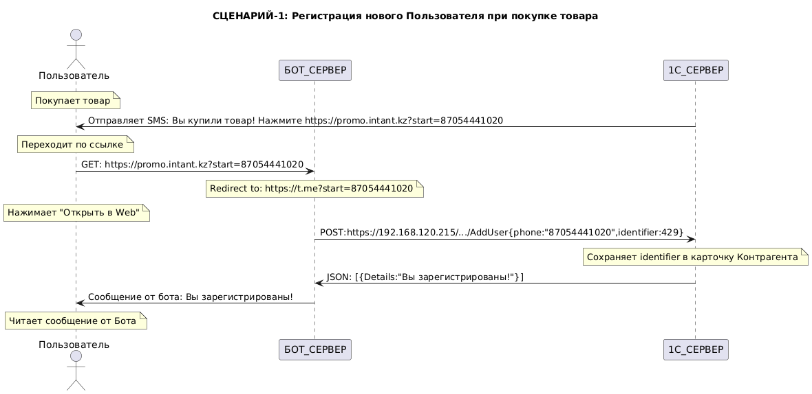
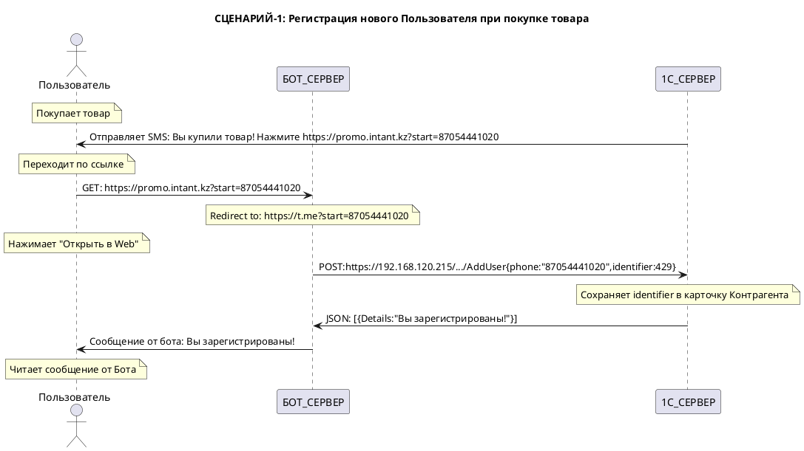

# Ktor + kotlin-telegram-bot Example

## Описание

Данный проект поднимает сервер на порту `8000` (через [Ktor](https://ktor.io/) и Netty) и запускает Telegram-бот с помощью библиотеки [kotlin-telegram-bot](https://github.com/kotlin-telegram-bot/kotlin-telegram-bot). Основные сценарии:

1. **/start <номер_телефона>**
   - Связывает телефон и текущий Telegram `userId` (числовой).
   - Вызывает `OneCService.connectClient(...)`.
   - Сразу запрашивает билеты (`OneCService.getTicketsByTelegramId(userId)`).

2. **Кнопка «Мои билеты»**
   - Повторно запрашивает билеты.
   - Бот не хранит связку у себя — всё в 1С (или заглушке).

3. **Кнопка «Справка»**
   - Выводит дополнительную информацию о функционале бота.
   - Уточняет, что `userId` — это числовой идентификатор пользователя (не username, который может отсутствовать).
   - Описывает заглушечную реализацию `OneCService` и необходимость дописать реальный запрос.

4. **Массовая рассылка**
   - `POST /send-broadcast`
   - Ожидается JSON:
     ```json
     {
       "telegramIds": [12345678, 87654321],
       "message": "Информационное сообщение"
     }
     ```
   - Бот вызывает `BotModule.sendMessageToUser(...)` для каждого идентификатора.

## Установка и запуск

1. Убедиться, что в окружении определена переменная `TELEGRAM_BOT_TOKEN` (с реальным токеном), либо вписать в код.
2. Выполнить:
   ```bash
   ./gradlew run
   ```
   
   ```bash
   TELEGRAM_BOT_TOKEN=[telegramm token here] nohup java -jar bot.jar > bot.log 2>&1 &
   ```
   
# AddUser Sequence Diagram


PlantUML. Paste code below here [https://www.plantuml.com/plantuml/uml](https://www.plantuml.com/plantuml/uml)
